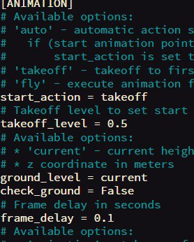
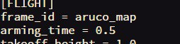

sudo nano ```/etc/apt/sources.list```:
```
deb http://legacy.raspbian.org/raspbian buster main contrib non-free rpi
deb-src http://archive.raspbian.org/raspbian/ buster main contrib non-free rpi
deb http://packages.coex.tech buster main
```
