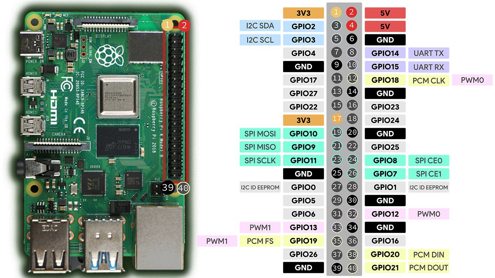

На фото распиновка подключения сервы к разбе. (инфа по нему ниже)

Для работы сервы вам необходимо ввести в терминал:
1) Установить на дронус пигпио:
```sudo apt install pigpio python3-pigpio```

2) Запустить его:
```sudo systemctl start pigpiod.service```

* для автозапуска пигпио:
```sudo systemctl enable pigpiod.service```

3) Код для отработки сервы:
https://clover.coex.tech/ru/gpio.html#подключение-сервоприводов

4) Подключение сервы к разбе:
*Юзайте для подключения к разбе провода "мама-папа"
5) 
*1* --- жёлтый (крайний) провод, тыкаем в GPIO13 для работы сервы

*2* --- красный (по середине) провод, который отвечает за питание, тыкаем по дефолту в 3х вольтовку, если не робит, перетыкаем в 5 В (фулл распиновка у вас есть, не проебётесь)

*3* --- черный провод (крайний), заземление, тыкаем в любой GND пин
```import rospy
import pigpio
import time

rospy.init_node('flight')


pi = pigpio.pi()

pi.set_mode(13, pigpio.OUTPUT)

def sbros():

    pi.set_servo_pulsewidth(13, 1000)
    time.sleep(2)
    pi.set_servo_pulsewidth(13, 2000)

sbros()```
